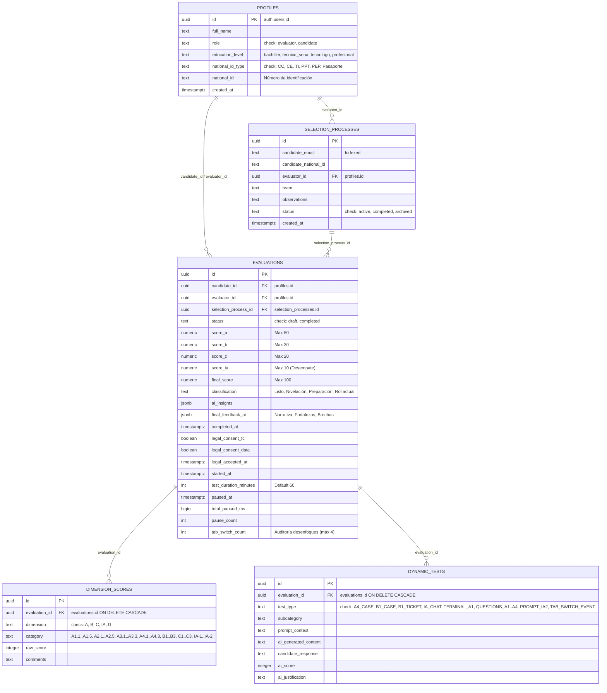

# AGENTS.md — OTP (Observability Talent Pivot)

## 1. Propósito del Proyecto

**OTP** es una plataforma de evaluación de talento técnico para equipos de infraestructura y operaciones. Permite a un **Evaluador** calificar a un **Candidato** en cuatro dimensiones (Técnica, Blandas, Cultural e IA) y obtener un dictamen automatizado asistido por IA.

---

## 2. Stack Tecnológico

| Capa | Tecnología | Versión |
|---|---|---|
| Framework | Next.js (App Router, Turbopack) | 16.1.6 |
| UI | React + Tailwind CSS v4 + Shadcn UI v4 (base-ui) | React 19.2.3 |
| Lenguaje | TypeScript | ^5 |
| Base de datos | Supabase (PostgreSQL + Auth + RLS) | SDK 2.98 |
| IA Generativa | Google Gemini (Gemini 3.7 Flash, 3.5 Flash Lite, 2.5 Flash Lite) | SDK 0.24.1 |
| Gráficos | Recharts | ^3.8 |
| Animaciones | Framer Motion | ^12.35 |
| Iconos | Lucide React | ^0.577 |
| Despliegue | Vercel | — |
| Observabilidad | OpenTelemetry (Metrics, Logs, Traces) | SDK 1.x |

---

## 3. Modelos de IA (Fallback & Resiliency Strategy)

Configuración en `src/lib/ai/gemini.ts`.

| Tipo de Tarea | Modelo Principal (Intento 1) | Fallback 1 (Intento 2) | Fallback 2 (Intento 3) |
|---|---|---|---|
| **Generación** | `gemini-3.7-flash` (~3.7s) | `gemini-3.5-flash-lite` (~1.7s) | `gemini-2.5-flash-lite` (~1.2s) |
| **Evaluación** (JSON) | `gemini-3.7-flash` (~3.3s) | `gemini-2.5-flash` | `gemini-2.5-flash-lite` |
| **Reportes** (Narrativa) | `gemini-3.7-flash` (~3.8s) | `gemini-3.5-flash-lite` | `gemini-2.5-flash-lite` |

- **Resiliencia (Fallback)**: Si un modelo falla por cuota (429) o disponibilidad (503/500/404/400), el sistema conmuta automáticamente hacia el siguiente en la cadena tras un delay exponencial (2s × 2^attempt).
- **Manual Backup Strategy**: Se ha implementado un botón "Regenerar con IA (Back up)" en la interfaz del reporte. Este botón ignora la cadena de fallback y llama directamente a la cadena ultrarrápida `['gemini-3.5-flash-lite', 'gemini-2.5-flash-lite']` para garantizar la generación en situaciones de alta latencia.
- **PII Filter**: Eliminado intencionalmente. El usuario ha confirmado que desea capturar `prompt` y `completion` incluso en producción para auditoría técnica.
- **Variable de entorno**: Usa `APP_GEMINI_API_KEY` (NO `GEMINI_API_KEY`) para evitar colisiones con el entorno del sistema.
- **Observability**: Toda llamada a la IA debe registrarse usando `metricsApp.recordAiRequest()` y envolverse en un Span de OTel (`tracer.startActiveSpan`).
- **Logging**: El log de la API Key solo se ejecuta en `development` (`process.env.NODE_ENV === 'development'`).

---

## 4. Cumplimiento Legal (Compliance)

### Ley 1581 de 2012 (Colombia)
- El sistema implementa un paso de **Onboarding Legal** obligatorio para todo candidato antes de acceder a la evaluación.
- **Evidencia de Consentimiento**: Se almacena `legal_consent_tc`, `legal_consent_data`, `legal_accepted_at` y el estado de los checkboxes en cada registro de la tabla `evaluations`.
- **Regla Crítica**: No se permite el avance al test técnico sin el consentimiento previo, expreso e informado. Los checkboxes deben estar desmarcados por defecto (*opt-in* explícito).

### Documentos Legales In-App
- **Términos y Condiciones**: Lectura completa disponible en ventana modal (Dialog). Texto fuente en `docs/specs/terminosCondiciones.md`.
- **Política de Tratamiento de Datos Personales**: Lectura completa disponible en ventana modal (Dialog). Texto fuente en `docs/specs/tratamientoDatosPersonales.md`.
- **Importante**: Abrir y cerrar los modales **NO** marca automáticamente los checkboxes de aceptación. El consentimiento siempre es una acción consciente del candidato.

### Server Action
- `src/app/actions/candidate/legal.ts`: Contiene `saveLegalConsent()` y `getLegalConsentStatus()`. Persiste el consentimiento por `evaluation_id`, no por candidato, garantizando procesos independientes.
- **Sincronización de Estado**: Al guardar el consentimiento legal, el estado del `CandidateContext` se actualiza inmediatamente vía `setLegalAccepted(true)` para evitar redirecciones cíclicas. Lo mismo aplica para `setEducationLevel()` en la página de eligibilidad.

---

## 5. Workflow de Desarrollo (CI/CD Local & Branching)

**Procedimiento Operativo Estándar (SOP) para Agentes:**
Para garantizar la estabilidad de producción, cualquier cambio destructivo o de esquema (DDL) debe seguir este flujo:

1. **Creación de Rama**: Solicitar o crear una rama de desarrollo `dev-*` en Supabase.
2. **Pruebas Aisladas**: Aplicar cambios SQL únicamente en el `project_id` de la rama.
3. **Verificación**: Validar el esquema y las políticas RLS en la rama antes de proponer el merge.
4. **Sincronización Local**: Actualizar el archivo `supabase/schema.sql` local una vez validados los cambios.

---

## 6. Arquitectura de Carpetas y Documentación

**REGLA DE ORO PARA DOCUMENTACIÓN:** Basado en las mejores prácticas de estructuración de proyectos Web modernos (como Next.js), se debe centralizar y colocar todas las documentaciones y especificaciones técnicas dentro de una única carpeta raíz `/docs` o `/docs/specs`. Almacenar especificaciones de manera aislada (ej. en carpetas `/specs` independientes) fragmenta la estructura y genera confusión sobre la ubicación de la fuente de verdad. El proyecto sigue estrictamente esta regla.

```
opera_eval_app/
├── docs/specs/                     # ÚNICA FUENTE DE VERDAD para Documentación, rúbricas, perfiles y textos.
│   ├── AGENTS.md                   # Este archivo (especificación para agentes IA)
│   ├── modelo-evaluacion-talento-tecnico.md    # Modelo de evaluación detallado
│   ├── terminosCondiciones.md      # Texto oficial de T&C
│   └── tratamientoDatosPersonales.md # Texto oficial Habeas Data (Ley 1581)
├── supabase/
│   └── schema.sql                  # DDL completo: tablas, RLS, functions (synced with prod)
├── src/
│   ├── types/
│   │   └── database.ts            # Tipos TypeScript de Supabase (manual)
│   ├── hooks/
│   │   ├── useA1State.ts          # Estado local de sub-dimensión A1
│   │   ├── useA2State.ts          # Estado local de sub-dimensión A2
│   │   ├── useA3State.ts          # Estado local de sub-dimensión A3
│   │   └── useCandidateContext.ts # Contexto global del candidato (evaluación, legal, educación)
│   ├── lib/
│   │   ├── ai/
│   │   │   └── gemini.ts           # Wrapper Gemini: fallback chain y retries
│   │   ├── constants.ts            # Constantes compartidas (TOOL_OPTIONS, EDUCATION_LABELS)
│   │   ├── utils.ts                # Utilidades (cn para clases CSS con clsx/twMerge)
│   │   ├── terminal/
│   │   │   └── commands.ts         # Motor de CLI simulada (FS virtual)
│   │   ├── supabase/
│   │   │   ├── client.ts / server.ts / middleware.ts
│   │   │   └── admin.ts            # Cliente con service_role para gestión de usuarios
│   │   └── evaluator-guidance.ts    # Guías estáticas para evaluadores (A3)
│   ├── components/
│   │   ├── CompanyLogo.tsx          # Logo corporativo reutilizable
│   │   ├── candidate/
│   │   │   ├── tabs/               # Fragmentos de UI para A1, A2, A3
│   │   │   ├── QuestionPanel.tsx   # Componente genérico reutilizable de Q&A
│   │   │   ├── TerminalSandbox.tsx  # Terminal Linux/Git simulada
│   │   │   ├── ChatbotA4.tsx        # Chat interactivo de investigación
│   │   │   ├── TicketEditor.tsx     # Editor de ticket B1
│   │   │   └── PromptEditorIA2.tsx  # Editor de prompt IA (Módulo D)
│   │   ├── evaluator/
│   │   │   ├── DimensionAEvaluation.tsx / DimensionBEvaluation.tsx ...
│   │   │   ├── DimensionDEvaluation.tsx # Módulo de IA (IA-1 e IA-2)
│   │   │   ├── FinalScoreCard.tsx   # Tarjeta de clasificación final con dictamen
│   │   │   ├── TimerAdjuster.tsx     # Widget para ajustar tiempo del candidato (+5/+10/+15 min o valor exacto)
│   │   │   ├── RadarChartComponent.tsx
│   │   │   ├── ScrollToTopButton.tsx # Botón flotante de navegación
│   │   │   └── dimension-a/         # Sub-evaluaciones A1, A2, A3, A4 + constantes
│   │   └── ui/                      # Primitivos Shadcn UI (dialog, tooltip, checkbox, label, etc.)
│   └── app/
│       ├── actions/                 # Server Actions
│       │   ├── ai.ts                # Lógica de IA generativa y evaluación
│       │   ├── admin.ts             # Gestión administrativa de usuarios
│       │   ├── evaluation.ts        # Operaciones sobre evaluaciones
│       │   ├── candidate/           # Acciones específicas del candidato
│       │       ├── a1.ts … a4.ts    # Dimensión A (Técnica)
│       │       ├── b1.ts            # Dimensión B (Blandas: Tickets)
│       │       ├── ia.ts            # Dimensión D (IA)
│       │       ├── evaluation.ts    # Timer: startEvaluationTimer, pauseEvaluation, resumeEvaluation
│       │       └── legal.ts         # Consentimiento legal (saveLegalConsent, getLegalConsentStatus)
│       │   └── evaluator/           # Acciones específicas del evaluador
│       │       └── timer.ts         # Ajuste de temporizador (add/set minutes)
│       ├── auth/
│       │   └── signout/route.ts     # Ruta de cierre de sesión (Server Route)
│       ├── candidate/               # Interfaz de examen del candidato
│       │   ├── onboarding/          # Consentimiento legal con modales (T&C + Habeas Data)
│       │   ├── eligibility/         # Selección de nivel académico con tooltips
│       │   └── page.tsx             # Examen principal (dimensiones A-D)
│       ├── evaluator/               # Dashboard y evaluación
│       │   └── history/             # Búsqueda histórica de procesos
│       ├── admin/                   # Panel de administración de usuarios
│       └── login/                   # Autenticación
```

---

## 6. Rutas y Seguridad

- **Middleware** (`src/proxy.ts` → `src/lib/supabase/middleware.ts`): Protege `/evaluator`, `/candidate` y `/admin`. Los candidatos sin consentimiento legal son redirigidos a `/candidate/onboarding`. Los candidatos sin `education_level` son redirigidos a `/candidate/eligibility`.
- **RBAC**: El rol `evaluator` es necesario para acceder a `/admin` y realizar evaluaciones.
- **RLS**: Protege datos sensibles. Los candidatos solo ven/modifican/borran sus propias evaluaciones, pruebas dinámicas y campos de consentimiento legal. Los evaluadores tienen acceso completo.
- **Restricciones Anti-Copia**: Los inputs del candidato (ChatbotA4, QuestionPanel, TerminalSandbox, TicketEditor) bloquean `onPaste`, `onCopy` y `onContextMenu` para evitar trampas. El editor de prompt IA-2 (`PromptEditorIA2`) está exento de estas restricciones.

---

## 7. Modelo de Evaluación y Normalización

### Dimensiones y Pesos

| Dimensión | Máx. Puntos | Notas de Normalización |
|---|---|---|
| **A — Técnica** | 50 | A1(15), A2(15), A3(10 de 12 pts raw), A4(10 de 9 pts raw) |
| **B — Blandas** | 30 | B1(7 de 16 pts), B2(7 de 16 pts), B3-B6(4 de 12 pts c/u) |
| **C — Cultural** | 20 | C1(5), C2(5), C3(5), C4(5) |
| **D — IA (Comp.)** | (10) | **Desempate**. IA-1 (5), IA-2 (5). No suma al total principal. |

### Clasificación Final
- **≥ 80**: Listo para pivotar (Verde)
- **60–79**: Pivote con nivelación (Amarillo)
- **40–59**: En preparación (Naranja)
- **< 40**: Continúa en Soporte Nivel 1 (Rojo)

---

## 8. Temporizador y Control de Integridad (Reloj Continuo y Control de Foco)

### Configuración
- **Duración por defecto**: 60 minutos (configurable y extensible por el evaluador en tiempo real).
- **Reloj Continuo**: El cronómetro nunca se detiene bajo ninguna circunstancia del lado del candidato (no existen pausas que congelen el tiempo).
- **Límite de Cambios de Ventana/Pestaña**: Máximo 4 advertencias por evaluación (`recordTabSwitch`).
- **Modal de Integridad (`TabSwitchWarningModal.tsx`)**: Se despliega automáticamente al salir de la pestaña o minimizar la ventana, indicando el número de intento ($X$ de 4) y recordando que el reloj sigue avanzando sin detenerse.
- **Auditoría de Foco**: Si el candidato supera los 4 cambios permitidos, los eventos adicionales quedan registrados en `dynamic_tests` (`test_type: 'TAB_SWITCH_EVENT'`) como telemetría de integridad para el evaluador.

### Arquitectura del Timer
- **Server Actions** (`src/app/actions/candidate/evaluation.ts`): `startEvaluationTimer()`, `recordTabSwitch()`, `getTimerState()`. Las acciones actualizan la DB sin interferir con la continuidad del reloj.
- **Estado optimista y continuo**: `CandidateContext` calcula el tiempo restante de forma estrictamente lineal:
  $$\text{elapsed} = \text{now} - \text{startedAt}$$
  $$\text{remaining} = \max(0, \text{testDuration} \times 60 - \lfloor \text{elapsed} / 1000 \rfloor)$$
- **Polling de duración**: El `CandidateContext` hace polling cada 30 segundos de `test_duration_minutes` para reflejar ajustes del evaluador sin recargar la página.
- **Posición visual**: El timer se renderiza en el centro del **sticky header** (`CandidateHeader.tsx`), con cambio de color según urgencia (verde > 10 min, ámbar < 10 min, rojo pulsante < 2 min).

### Ajuste de Tiempo por el Evaluador
- **Server Action** (`src/app/actions/evaluator/timer.ts`): `adjustEvaluationTime(evaluationId, 'add'|'set', minutes)`. Validación: 1-180 minutos.
- **Widget UI** (`TimerAdjuster.tsx`): Botones rápidos (+5, +10, +15 min) + input para fijar un valor exacto + badge de telemetría de cambios de ventana ($X$ / 4). Ubicado en el sidebar de `/evaluator/evaluate/[id]`.

---

## 9. Flujos Especiales

- **Persistencia de Preguntas (A1, A2, A3)**: Las preguntas generadas por IA se persisten inmediatamente en `dynamic_tests` vía `saveA*QuestionsOnly()`. Esto previene la pérdida de datos por recarga de página. Solo se regeneran si el evaluador ejecuta un _reset_.
- **A1 (Telemetría de Terminal Linux)**: Registro automático de los comandos ejecutados en la sandbox en `dynamic_tests` (`TERMINAL_A1`), visibles para el evaluador como evidencia cualitativa de soltura en CLI.
- **A2 (Herramienta)**: El candidato selecciona su herramienta de observabilidad (Dynatrace / Grafana Loki). La selección y las preguntas se persisten con `candidate_response = ''` hasta que el candidato las responda.
- **A3 (Git & Pandas)**: Ejercicios prácticos de control de versiones con Git y análisis de métricas y anomalías con Pandas (escala normalizada base 9 $\rightarrow$ 10).
- **A4 (Caso Práctico)**: Generación persistente de incidente en DB (`A4_CASE`). Chat interactivo (`IA_CHAT`) que se bloquea al finalizar. Evaluación IA en 3 subcategorías.
- **B1 (Ticket)**: Escenario dinámico (`B1_CASE`). Evaluación vía IA basada en rúbrica de 4 criterios (Estructura, Precisión, Acciones, Impacto).
- **IA-2 (Prompting)**: El candidato ingresa el prompt técnico para consultas en Dynatrace / Grafana Loki. Gemini evalúa la sofisticación del contexto y sugiere puntaje al evaluador.

---

## 10. Base de Datos & Diagrama Entidad-Relación (ER)

### Diagrama Entidad-Relación



### Tablas y Propósito

| Tabla | Propósito |
|---|---|
| `profiles` | Datos del usuario (nombre, rol, nivel educativo, documento de identidad) |
| `selection_processes` | Procesos de selección por candidato (con email, CC, equipo, observaciones) |
| `evaluations` | Evaluación vinculada a un proceso (puntajes por dimensión, clasificación, consentimiento legal y timer) |
| `dimension_scores` | Scores detallados por categoría dentro de cada dimensión |
| `dynamic_tests` | Pruebas dinámicas: preguntas, respuestas, scores IA, chat, tickets, prompts, telemetría de terminal y eventos de foco |

### Campos del Timer, Foco y Auditoría (tabla `evaluations`)

| Campo | Tipo | Propósito |
|---|---|---|
| `started_at` | timestamptz | Marca de inicio ininterrumpido de la evaluación |
| `test_duration_minutes` | int (default 60) | Duración total configurable exclusivamente por evaluador |
| `tab_switch_count` | int (default 0) | Contador de cambios de ventana / desenfoques detectados (máx. 4 permitidos) |
| `legal_consent_tc` | boolean | Aceptación de Términos y Condiciones |
| `legal_consent_data` | boolean | Autorización de Tratamiento de Datos |
| `legal_accepted_at` | timestamptz | Estampa de tiempo del consentimiento |

### Documentos de Identificación

La plataforma soporta los siguientes tipos de documento nacional colombiano:
- **CC**: Cédula de Ciudadanía
- **CE**: Cédula de Extranjería
- **TI**: Tarjeta de Identidad
- **PPT**: Permiso por Protección Temporal
- **PEP**: Permiso Especial de Permanencia
- **Pasaporte**: Documento de viaje internacional

El tipo se almacena en `profiles.national_id_type` y el número en `profiles.national_id`.

### RLS Policies y Rendimiento

- **RLS Performance**: 
    - Se ha implementado el patrón **InitPlan Optimization** envolviendo las llamadas a `auth.uid()` y `auth.jwt()` en subqueries: `(select auth.uid())`, `((select auth.jwt()) ->> 'email')`. Esto previene la re-evaluación fila por fila.
    - **Consolidación**: Se han fusionado múltiples políticas permisivas en una sola regla con lógica `OR` para reducir la sobrecarga del motor de reglas de Supabase.
- **Seguridad RPC**: La función `get_user_email(uuid)` tiene permisos revocados para `anon` y restringidos únicamente a `authenticated`.
- **Indexación**: Índices dedicados en llaves foráneas (`evaluation_id`, `candidate_id`, `selection_process_id`, `candidate_email`, `test_type`).

---

## 11. Convenciones Técnicas

1. **Next.js Params**: Siempre `await params` en rutas dinámicas.
2. **Server Actions**: Marcadas con `'use server'`. Lógica de negocio e IA concentrada aquí.
3. **test_type (dynamic_tests)**: Valores permitidos en el constraint SQL: `A4_CASE`, `B1_CASE`, `B1_TICKET`, `IA_CHAT`, `TERMINAL_A1`, `TERMINAL_A3`, `TERMINAL_A4`, `QUESTIONS_A1`, `QUESTIONS_A2`, `QUESTIONS_A3`, `QUESTIONS_A4`, `QUESTIONS_B1`, `PROMPT_IA2`.
4. **Environment**: Usar estrictamente `APP_GEMINI_API_KEY`.
5. **Supabase Generics**: Clientes con `<any, 'public'>` (sin `supabase gen types`). Los tipos manuales están en `src/types/database.ts`.
6. **Constantes compartidas**: Definidas en `src/lib/constants.ts` (ej. `TOOL_OPTIONS`, `EDUCATION_LABELS`). No duplicar en componentes.
7. **Persistencia de preguntas**: Usar `saveA*QuestionsOnly()` inmediatamente después de generar preguntas por IA. Incluir `evaluationId` en el array de dependencias de `useCallback`.
8. **Schema sync**: El archivo `supabase/schema.sql` debe mantenerse sincronizado con la BD de producción. La última verificación fue el 2026-04-07.
9. **UI Componentes**: Shadcn UI v4 (basado en Base UI de @base-ui/react). NO usar la prop `asChild` (no existe en esta versión). Aplicar estilos directamente con `className` en `DialogTrigger`, `DialogClose`, `TooltipTrigger`, etc.
10. **Diseño Legal**: Los textos legales oficiales deben provenir siempre de los archivos en `docs/specs/`. No alterar el texto sin aprobación explícita de la organización.
11. **Hydration Safety**: `<html>` y `<body>` en `layout.tsx` incluyen `suppressHydrationWarning` para evitar falsos positivos causados por extensiones del navegador.
12. **Eliminación y Edición (Admin)**: 
    - Al eliminar un usuario, `deleteUser()` archiva sus procesos activos.
    - Al editar un usuario, no se permite el cambio de **Email** ni **Rol** por integridad de datos. Se incluye un tooltip informativo al respecto. Se permite editar Nombre, ID, Equipo y Observaciones (estas últimas impactan el proceso activo).
13. **Auto-Fill Técnico (Dimensión B)**: La interfaz del evaluador en B1/B6 detecta respuestas de IA y mueve los sliders automáticamente a la posición sugerida si el evaluador no ha intervenido manualmente.
14. **Recordatorio: Revisión Realtime**: Se ha implementado un componente `RealtimeSync` para suscripción vía WebSockets a `dynamic_tests`. Esta funcionalidad requiere una auditoría técnica profunda en el futuro para validar escalabilidad y manejo de reconexiones. Queda fuera de la documentación de "mejoras finalizadas" hasta entonces.

---

## 11. Decisiones Arquitectónicas Documentadas

| Decisión | Razón | Fecha |
|---|---|---|
| PII filter eliminado | Falsos positivos con timestamps y datos técnicos | 2026-03-31 |
| `diagnostics.ts` eliminado | Exponía API key en logs del servidor | 2026-03-31 |
| `test_db.ts` eliminado | Script ad-hoc con credenciales de servicio | 2026-03-31 |
| Candidate DELETE policy en RLS | Necesario para `saveA*QuestionsOnly` (limpiar y regenerar preguntas) | 2026-03-31 |
| Constantes centralizadas en `constants.ts` | Evitar drift entre copias duplicadas | 2026-03-31 |
| Modales legales en lugar de enlaces externos | Retención del candidato en el flujo, evita placeholders rotos | 2026-04-07 |
| Consentimiento por `evaluation_id` (no por candidato) | Permite procesos de selección independientes para un mismo usuario | 2026-03-31 |
| `asChild` eliminado de Shadcn v4 | Base UI no soporta esta prop; estilos directos en className | 2026-04-07 |
| `revalidatePath` eliminado del timer | Causaba delays de 5-13s y loops al pausar/reanudar; estado optimista via Context | 2026-04-07 |
| Duración reducida de 90 a 60 minutos | Análisis de viabilidad: 22 ítems con ~2.7 min/pregunta (ver `specs/duracion-evaluacion-60min.md`) | 2026-04-07 |
| `suppressHydrationWarning` en layout | Extensiones del navegador inyectan atributos en `<body>` causando falsos positivos | 2026-04-07 |
| Admin delete archiva procesos | Previene procesos huérfanos y conflictos al recrear el mismo email | 2026-04-07 |
| Setters expuestos en CandidateContext | `setLegalAccepted`, `setEducationLevel` evitan redirect loops en onboarding | 2026-04-07 |
| Timer ajustable por evaluador | Permite dar tiempo extra (+5/+10/+15 min o valor exacto) sin interrumpir la prueba | 2026-04-07 |
| Pausas aumentadas (2 -> 3) | Solicitud de usuario para mejorar la flexibilidad en la prueba | 2026-04-09 |
| Edición de perfiles restringida | Permite corregir errores (nombre/id) pero bloquea email/rol por estabilidad | 2026-04-09 |
| Optimización Crítica de RLS | Uso de `(select auth.uid())` y consolidación de políticas para performance | 2026-04-09 |
| Auto-fill asíncrono en B1 | Sliders reaccionan a sugerencias de IA automáticamente en el dashboard del evaluador | 2026-04-09 |
| Manual Backup (IA Lite) | Botón manual que fuerza el uso de Gemini Lite para evitar fallos de cuota en reportes | 2026-04-09 |
| Rediseño Historial Navegación | Estandarización a columna "Acciones" con flujo Ver Resultado -> Ver Reporte | 2026-04-09 |
| Sincronización Proceso Status | Finalizar evaluación marca automáticamente el proceso como `completed` | 2026-04-09 |
| Auditoría de Documentación | Sincronización masiva de specs con la realidad técnica del proyecto | 2026-04-09 |
| Integración de OTel | Consolidación de logger y métricas estandarizadas vía OpenTelemetry | 2026-04-13 |
| **Ecosistema MCP** | Documentación de capacidades extendidas (GitHub, Supabase, Vercel) | 2026-04-15 |
| **Alineación Ruta Observabilidad** | A1 (Linux/AWS Core), A2 (SRE/Dynatrace/Grafana), A3 (Git/Pandas), Dim B (B1-B3) y C (C1-C3) | 2026-08-21 |
| **Reloj Continuo e Integridad (Máx 4)** | Eliminación de pausas; reloj ininterrumpido y límite de 4 cambios de ventana con modal de advertencia | 2026-08-21 |

---

## 12. Ecosistema de Protocolo de Contexto (MCP)

Este proyecto utiliza el **Model Context Protocol (MCP)** para extender las capacidades de los agentes IA, permitiendo una interacción segura y estructurada con la infraestructura externa. La configuración reside en el archivo de sistema local del usuario.

### Servidores y Utilidades

| Servidor | Utilidad en el Proyecto | Herramientas Clave |
|---|---|---|
| **GitHub** | Gestión de código, ramas y Pull Requests. Vital para el flujo de CI/CD local del agente. | `create_pull_request`, `list_issues`, `get_file_contents` |
| **Supabase** | Gestión de base de datos, migraciones y funciones. Permite validar cambios DDL antes del despliegue. | `execute_sql`, `apply_migration`, `list_tables` |
| **Vercel** | Gestión de despliegues, logs y monitoreo. Útil para auditoría de producción y debug de envs. | `get_runtime_logs`, `list_projects`, `search_vercel_documentation` |

### Escenarios de Uso (Mejores Prácticas)
- **Degradación de Performance**: Si Grafana reporta latencia, usar `mcp_vercel_get_runtime_logs` para identificar errores 5xx en tiempo real sin salir del editor.
- **Cambios en Esquema**: No aplicar SQL a ciegas; usar `mcp_supabase_list_tables` para verificar el estado actual antes de proponer una migración incremental.
- **Integración de Código**: Al finalizar una tarea, usar `mcp_github-mcp-server_create_pull_request` para mover cambios a `main` siguiendo el flujo de trabajo oficial de la organización.
- **Gobernanza**: El agente debe preferir herramientas MCP sobre comandos manuales (scripts ad-hoc) siempre que exista una herramienta oficial disponible para la tarea.
